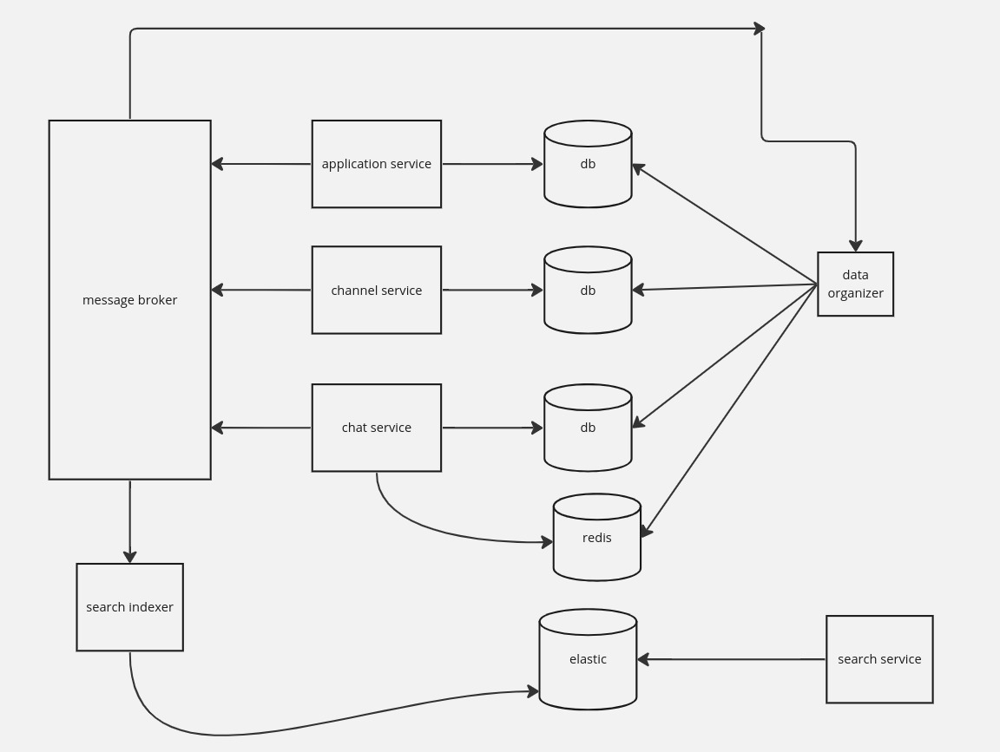

# Please note that this is the first time to use ruby on rails so the code may not follow the industry standards
# Chat Application High-Level System Design

## Overview

The Chat Application will be better to be designed using a microservices architecture to leverage scalability and minimize downtime. The system comprises several services each responsible for specific functionalities.

## Components

1. **Application Service**
   - Handles application logic and interactions.
   - Owns its dedicated database, possibly SQL-based for structured data storage.

2. **Chat Service**
   - Manages chat-related functionalities.
   - Utilizes its own database, potentially SQL-based for efficient data management.

3. **Message Service**
   - Incorporates Redis as a caching layer for rapid read/write operations.
   - Persists data into a NoSQL database like Cassandra for scalability and fault tolerance.

4. **Data Organizer Service**
   - Responsible for updating count columns within chats and applications.
   - Ensures data integrity and consistency across the system.

5. **Data Indexer Service**
   - Indexes data into Elastic Search for efficient search operations.
   - Enables fast retrieval and analysis of chat messages.

6. **Search Service**
   - Facilitates searching through messages using Elastic Search.
   - Offers robust search capabilities for users to find relevant information quickly.

7. **Message Broker**
   - Enables asynchronous communication between services.
   - Ensures decoupling and scalability of the system.

## Architecture

The system follows a decentralized architecture where each service operates independently, communicating asynchronously through message brokers. This architecture enhances scalability, fault tolerance, and performance.

## Technology Stack

- **Backend**: ruby on rails (for microservices)
- **Databases**:
  - SQL (for Application and Chat services)
  - Redis (for Message service caching)
  - NoSQL (Cassandra for Message persistence)
  - Elastic Search (for indexing and searching)
- **Message Broker**: Kafka or RabbitMQ
- **Deployment**: Docker containers orchestrated by Kubernetes

## Advantages

- **Scalability**: Each service can scale independently based on demand.
- **Fault Tolerance**: Decentralized architecture minimizes the impact of failures.
- **Performance**: Caching with Redis and indexing with Elastic Search optimize data access.
- **Maintainability**: Microservices enable easier maintenance and updates.
- **Modularity**: Each service encapsulates specific functionalities, promoting code reusability and easier debugging.

## Conclusion

The proposed microservices architecture for the Chat Application ensures efficient handling of application logic, chat functionalities, messaging, and data organization. By leveraging technologies like Redis, Cassandra, Elastic Search, and asynchronous communication, the system is poised for scalability, reliability, and optimal performance.

# Task implementation System Design

This project implements a monolithic chat application using Rails framework, MySQL for database storage, Redis for caching, background jobs for updating count columns, and Elastic for search functionalities.

## Setup Instructions

### Prerequisites

Make sure you have Docker installed on your system.

### Steps to Run the Application

1. Clone this repository to your local machine:

    ```bash
    git clone <repository_url>
    ```

2. Navigate to the project directory:

    ```bash
    cd instabug_task
    ```

3. Build the Docker image using the provided Dockerfile:

    ```bash
    docker build -t myapp .
    ```

4. Use Docker Compose to spin up the containers:

    ```bash
    docker-compose up
    ```
5. wait 10s before accessing the application so that the database is initialized and tables are migrated.

6. Access the application in your web browser at `http://localhost:4000`.

### Accessing Postman REST APIs Collection

You can find the Postman REST APIs collection [here](./instbug_task.postman_collection.json).

## Technologies Used

- **Framework**: Ruby on Rails
- **Database**: MySQL
- **Caching**: Redis
- **Background Jobs**: Sidekiq
- **Search**: Elastic

## Docker Configuration

The project includes Dockerfile and Docker Compose file to facilitate containerization and deployment.

### Dockerfile

The Dockerfile is configured to build an image for the Rails application. It sets up the necessary environment and dependencies to run the application within a Docker container.

### Docker Compose

The `docker-compose.yml` file defines services for the Rails application, MySQL, Redis, and Elastic. It orchestrates these services and allows easy management and scaling of containers.
## TODO
-add authorization and authentication
-add proper error handing mechanism
-add cashing layer to messages and chats
## Conclusion

This monolithic chat application provides a basic implementation of chat functionalities using Rails, MySQL, Redis, background jobs, and Elastic. By containerizing the application with Docker, it ensures consistency and ease of deployment across different environments.

For more information, please refer to the Postman REST APIs collection for testing various endpoints and functionalities.

[Link to Postman REST APIs Collection](./instbug_task.postman_collection.json)
